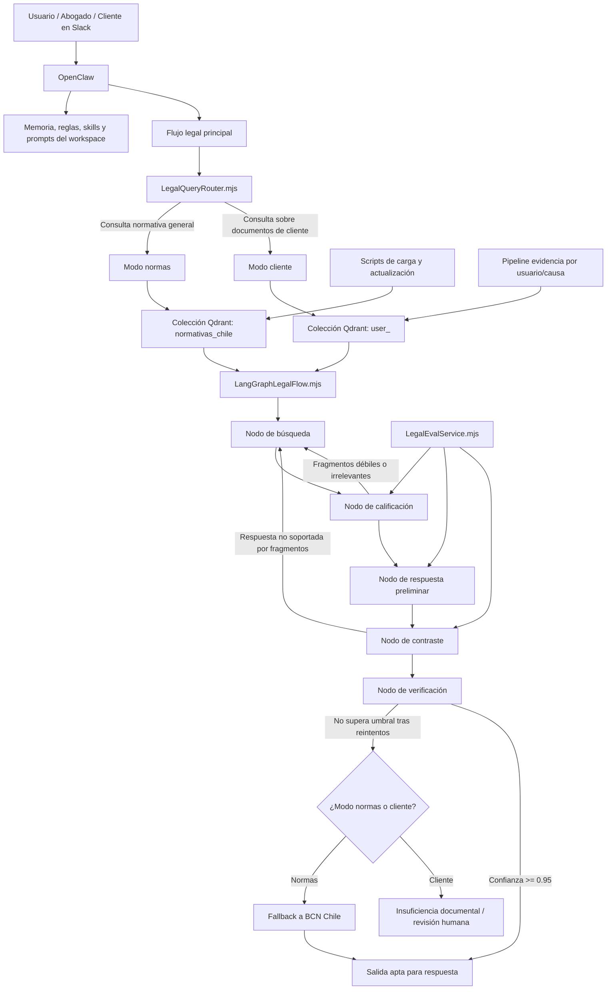

# Arquitectura del sistema legal con OpenClaw, Qdrant y LangGraph

## 1. Diagrama técnico en Mermaid



## 2. Qué hace LangGraph en este proyecto

LangGraph no reemplaza a Qdrant ni a OpenClaw. Su rol es orquestar el flujo legal por etapas para que la respuesta no salga de una sola pasada sin control.

En este sistema, LangGraph hace lo siguiente:

1. recibe una consulta ya enrutada o la enruta con `LegalQueryRouter.mjs`
2. consulta Qdrant
3. revisa si los fragmentos realmente sirven
4. redacta una respuesta preliminar solo con soporte recuperado
5. contrasta esa respuesta contra los fragmentos
6. invalida la salida si detecta afirmaciones no respaldadas
7. reintenta hasta 3 veces
8. solo libera salida si supera el umbral de confianza
9. si no alcanza soporte:
   - en modo `normas`, deriva a BCN Chile
   - en modo `cliente`, marca revisión humana o insuficiencia documental

## 3. Componentes principales

### OpenClaw
Capa de interacción, memoria operativa, reglas, skills, herramientas, Slack y ejecución general.

### LegalQueryRouter.mjs
Decide si la consulta debe ir a:
- normativa general
- o colección documental del cliente

### LangGraphLegalFlow.mjs
Implementa el flujo por nodos:
- búsqueda
- calificación
- respuesta
- contraste
- verificación
- fallback

### LegalEvalService.mjs
Servicio interno que resuelve:
- calificación de fragmentos
- redacción preliminar
- contraste contra soporte

Puede usar modelo si está disponible. Si no, cae a heurísticas sin romper el flujo.

### Qdrant
Base semántica principal.

Colecciones principales:
- `normativas_chile`
- `user_<slug>` por cliente

### BCN Chile
Fuente secundaria oficial para normativa vigente cuando el corpus local no alcanza.

## 4. Flujo operativo detallado

### A. Consulta normativa general

1. El usuario pregunta por una ley, artículo, institución o efecto jurídico.
2. OpenClaw recibe la consulta.
3. `LegalQueryRouter.mjs` decide modo `normas`.
4. `LangGraphLegalFlow.mjs` consulta `normativas_chile` en Qdrant.
5. Se recuperan fragmentos.
6. Se evalúa relevancia.
7. Se redacta respuesta preliminar.
8. Se contrasta la respuesta con los fragmentos.
9. Si no hay soporte suficiente, se reintenta.
10. Si tras 3 intentos no alcanza, se habilita BCN Chile.
11. Solo sale una respuesta si logra el estándar definido.

### B. Consulta sobre documentos del cliente

1. El usuario pregunta por evidencia, contrato, cláusula o antecedente documental.
2. OpenClaw recibe la consulta.
3. `LegalQueryRouter.mjs` decide modo `cliente`.
4. `LangGraphLegalFlow.mjs` consulta la colección `user_<slug>`.
5. Se recuperan fragmentos del cliente.
6. Se evalúa soporte.
7. Se redacta respuesta preliminar.
8. Se contrasta.
9. Si no hay suficiente soporte, no se va a BCN.
10. Se marca insuficiencia documental o revisión humana.

## 5. Regla de oro del sistema

Si la respuesta contiene datos no respaldados por los fragmentos recuperados, no debe entregarse.

Eso significa:
- invalidar la respuesta
- reintentar
- o escalar a fallback/revisión humana según el modo

## 6. Umbral de salida

La salida ideal queda apta cuando supera el umbral operativo definido para confianza/utilidad.

Regla actual del diseño:
- confianza objetivo de salida: `>= 0.95`

## 7. Aislamiento de datos

El sistema debe mantener aislamiento estricto entre clientes.

Eso implica:
- una colección por cliente
- no mezclar causas por error
- extraer texto limpio antes de indexar
- no cruzar datos entre usuarios

## 8. Diagrama ejecutivo

```text
Slack / Usuario
   ↓
OpenClaw
   ↓
Router legal
   ↓
Qdrant (normas o documentos del cliente)
   ↓
LangGraph valida si alcanza el soporte
   ↓
Si está bien respaldado, responde
Si no está bien respaldado, reintenta o deriva
```

## 9. Explicación ejecutiva

La plataforma funciona como un asistente legal con memoria operativa y control de calidad de respuesta.

- OpenClaw recibe la consulta y maneja la interacción.
- Qdrant guarda la base semántica principal.
- LangGraph ordena el proceso de validación para evitar respuestas inventadas.
- BCN Chile entra solo como fuente secundaria cuando el soporte local no basta.
- Los documentos de clientes viven en colecciones separadas para mantener aislamiento.

## 10. Qué valor agrega LangGraph

Sin LangGraph, el sistema podría limitarse a:
- buscar fragmentos
- redactar una respuesta directa

Con LangGraph, el sistema gana:
- validación por etapas
- reintentos controlados
- contraste entre respuesta y soporte
- bloqueo de salidas débiles
- diferenciación entre consultas normativas y documentales
- fallback controlado en vez de improvisación

En corto:

- Qdrant trae material
- LangGraph decide si ese material realmente alcanza
- OpenClaw entrega la respuesta dentro del flujo operativo completo
